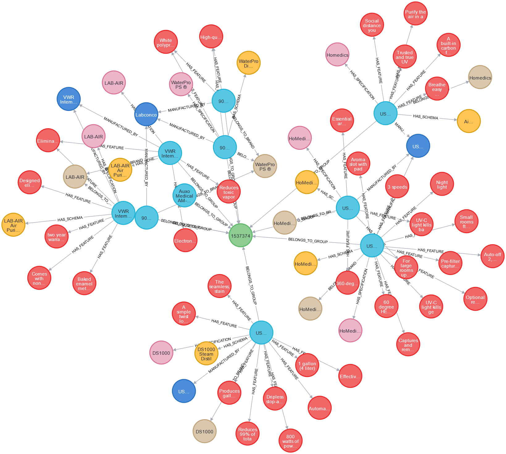

# One Stop Medical Shop

One stop eCommerce shop for providing medical equipments and products.


## Table of Contents
- [Woocommerce Store Setup](#woocommerce-store-setup)
- [Run Locally](#run-locally)
- [Environment Variables](#environment-variables)
- [Neo4j Visualization Screenshots](#neo4j-visualization-screenshots)
- [Authors And Contributors](#authors-and-contributors)
## Woocommerce Store Setup

To get it we need to complete the simple steps explained below
#### Step 1 - Login into WordPress
Login into the WordPress frontend. For default credentials refer under "User and Site default configuration" section in DEPLOYMENTS.md

#### Step 2 - Install a Ecommerce theme

Install any e-commerce based theme to transform our website into a store

```Dashboard > Appearance > Themes > Add new and search for "storefront"```

#### Step 3 - Install the Woocommerce plugin

Install the woo-commerce plugin similar to the last step

```Dashboard > Plugins > Add new and search for "woocommerce"```

#### Step 4 - Generate RestAPI keys

```Dashboard > Woocommerce > Settings > Advanced > RestAPI```
## Run Locally

#### Clone the project

```bash
  git clone https://gitlab.com/heyramak/one-stop-medical-shop
```
#### Json to Neo4j app

```bash
  cd /data-populate
  docker build -t data-populate-service .
  docker run -d --name=data-server --network=host data-populate-service
```
#### Backend app

```bash
  cd /backend
  docker build -t backend-service .
  docker run -d --name=backend-server --network=host backend-service
```


## Environment Variables

To run the above two project, you will need to add the following environment variables to your .env file

`BOLT_URI` - Neo4j URI

`BOLT_USERNAME` - Neo4j Username

`BOLT_PASSWORD` - Neo4j Password

`WC_URL` - Woocommerce URL

`WC_CONSUMER_KEY` - Woocommerce consumer key

`WC_CONSUMER` - Woocommerce consumer


## Neo4j Visualization Screenshots

#### Neo4j data overview 


#### Product and Feature Relationship 


#### Product Category Grouping


## Authors And Contributors

- [@heyramak](https://github.com/heyramak)

