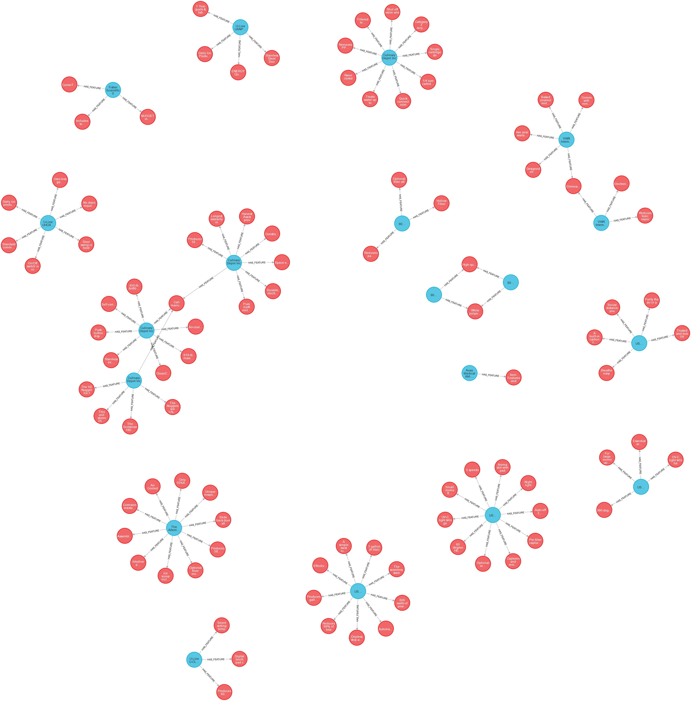
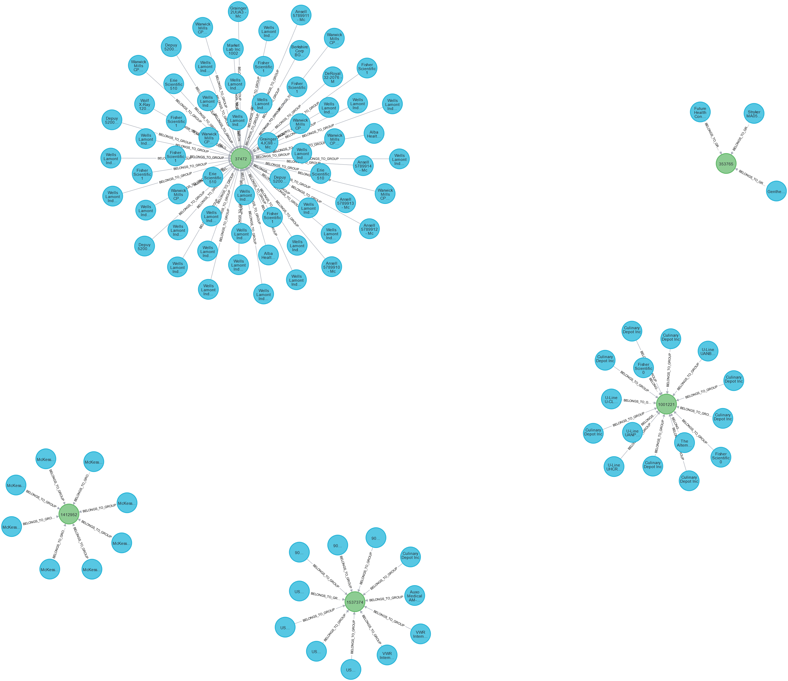

# One Stop Medical Shop

One stop eCommerce shop for providing medical equipments and products.

## Table of Contents
- [Initial Setup](#initial-setup)
- [Install Woocommerce Plugin And Ecommerce Theme](#install-woocommerce-plugin-and-ecommerce-theme)
- [Environment Variables](#environment-variables)
- [Ecommerce Application Screenshots](#ecommerce-application-screenshots)
- [Neo4j Visualization Screenshots](#neo4j-visualization-screenshots)
- [Authors And Contributors](#authors-and-contributors)
- [References](#references)

## Initial Setup
Go to DEPLOYMENTS.md file and follow all the steps mentined and check all the containers are up and running using the command below.
```bash
  docker ps
```
## Install Woocommerce Plugin And Ecommerce Theme

#### Step 1 - Install Plugin And Theme

Run the command below and notedown wordpress container name or id .

```bash
  docker ps
``` 
Replace the `CONTAINER_NAME_OR_ID` with Wordpress container name or ID on the command below to install woocommerce plugin.

```bash
  docker exec CONTAINER_NAME_OR_ID wp plugin install woocommerce --activate
```
Replace the `CONTAINER_NAME_OR_ID` with Wordpress container name or ID on the command below to install ecommerce theme.

```bash
  docker exec CONTAINER_NAME_OR_ID wp theme install minimalist-ecommerce --activate
```
#### Step 2 - Login Into Wordpress
Access the Wordpress from ```http://localhost:8080/wp-admin/``` and login with default credentials.
- Username: user
- Password: bitnami

#### Step 3 - Generate RestAPI keys

Follow the steps and generate the restapi keys and update that in .env files in both backend folder.
```Dashboard > Woocommerce > Settings > Advanced > RestAPI```


#### Data Population App For Neo4j
 
```bash
  cd /data-populate
  docker build -t data-populate-service .
  docker run -d --name=data-server --network=host data-populate-service
```
After succcesful completion this Docker container exit and you can see and verify all the JSON data in given dataset is populated along with its relationship in Neo4j browser ```http://localhost:7474```.
#### Backend App For Woocommerce-Wordpress

```bash
  cd /backend
  docker build -t backend-service .
  docker run -d --name=backend-server --network=host backend-service
```
- It will constantly fetch each and every product from Neo4j and push that to Woocomerce frontend.
- Now go to ```http://localhost:8080/wp-admin/``` and you can see the product updation in ```Dashboard > Products```.
- And you can see that also in frontend  by visiting ```http://localhost:8080/shop/```.
- After uploading each and every product to Woocommerce product catelogue the container will exit.
## Environment Variables

To run the above two project, you will need to add the following environment variables to your .env file.

`BOLT_URI` - Neo4j URI

`BOLT_USERNAME` - Neo4j Username

`BOLT_PASSWORD` - Neo4j Password

`WC_URL` - Woocommerce URL

`WC_CONSUMER_KEY` - Woocommerce consumer key

`WC_CONSUMER` - Woocommerce consumer

## Ecommerce Application Screenshots
#### Homepage

#### Shopping Page


#### Product Page


## Neo4j Visualization Screenshots
#### Neo4j Browser Homepage After Data Population


#### Sample Overview of 5 Products and All the Associated Relationship Nodes to It

#### Product And Feature Relationship 


#### Product Category Grouping


#### Product And Brand Relationship


#### Product And Manufacturer Relationship

## Authors And Contributors

- [@heyramak](https://github.com/heyramak)

## References
- [https://woocommerce.github.io/woocommerce-rest-api-docs/](https://woocommerce.github.io/woocommerce-rest-api-docs/)
- [https://neo4j.com/labs/apoc/4.1/import/load-json/](https://neo4j.com/labs/apoc/4.1/import/load-json/)
- [https://neo4j.com/developer/cypher/](https://neo4j.com/developer/cypher/)
- [https://docs.docker.com/network/](https://docs.docker.com/network/)

